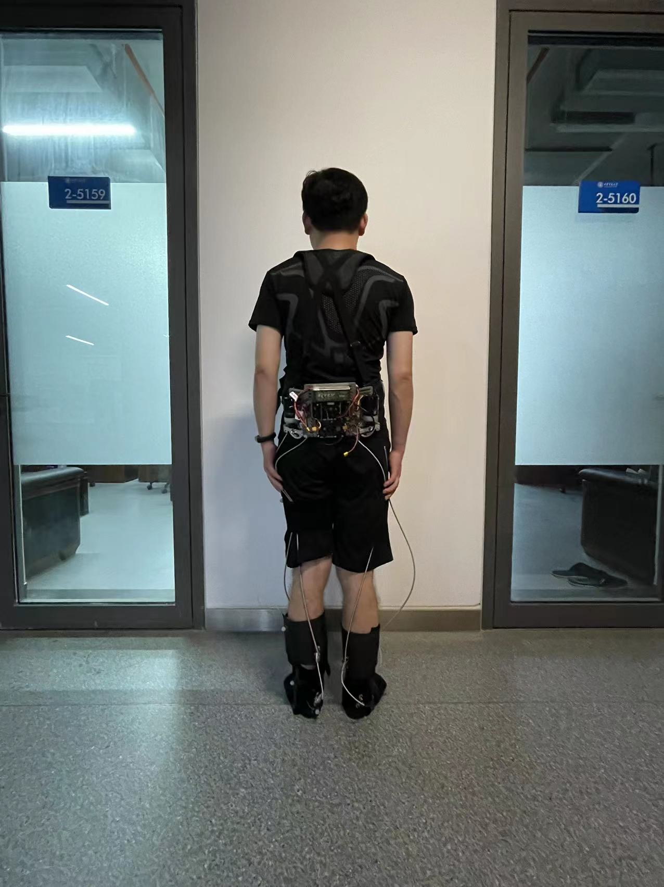
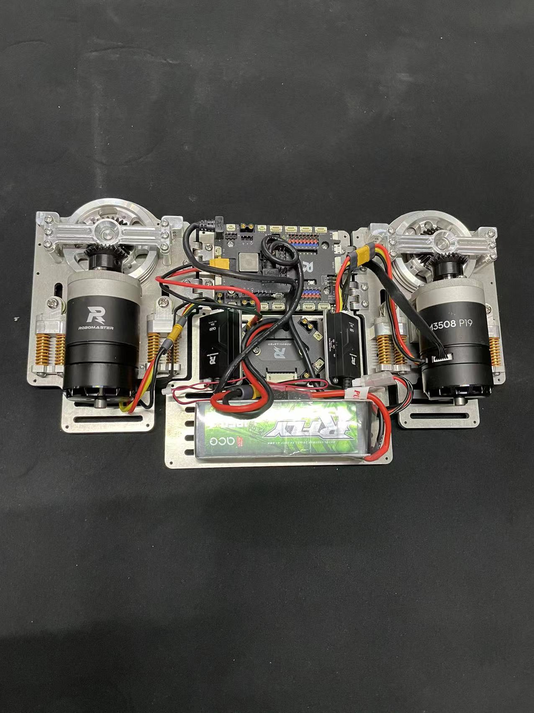

# Lower-limb-ankle-lasso-exoskeleton-robot
---
* ### Approval department: National Natural Science Foundation of China (`NSFC`)
* ### Project Requirement: Research on an exoskeleton robot that helps patients with lower `limb disorders` to walk Normally. 
* ### My responsibility: Design robotic structure, manufacture prototypes, test performance, design control algorithms.
* ### Problems & Solutions: The motion control accuracy of the lasso is low. Design an adaptive gait trajectory method with `multi-source sensing fusion`, improving the control precision.
* ## Gains: Learn about motion control principles, `C++`, sensor design, multi-source information processing, `robot modeling` and design methods. Obtain the 3rd prize in the National Graduate Robotics Competition.
---

Power drive unit, consisting of two symmetrical bevel gear transmission mechanism.

---

  

  Lasso exoskeleton robot wearing and walking
  

---

  

  Lower limb ankle lasso exoskeleton robot prototype
  

  
---
 

  

  Power output back box
  

